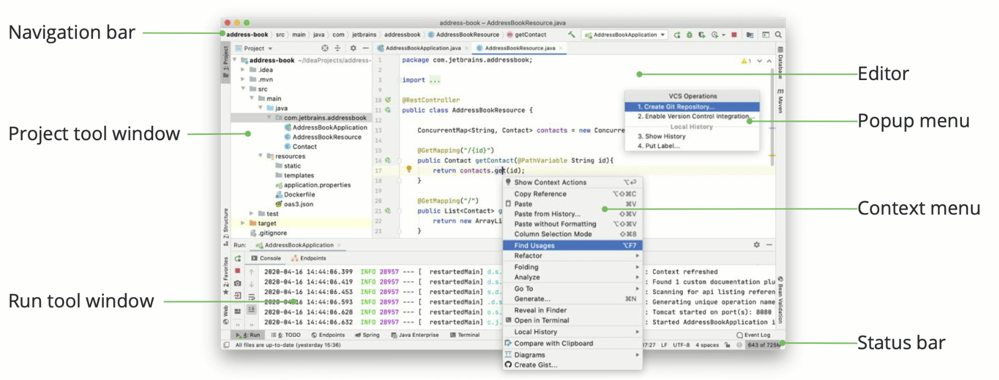
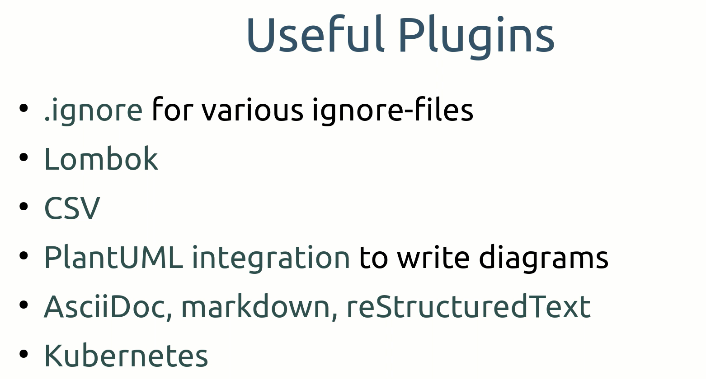
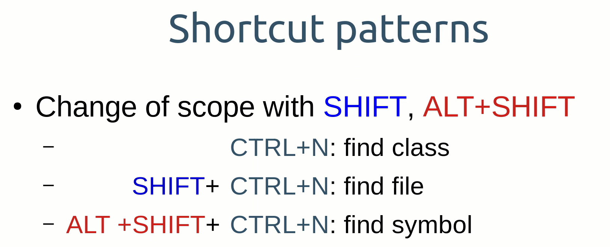
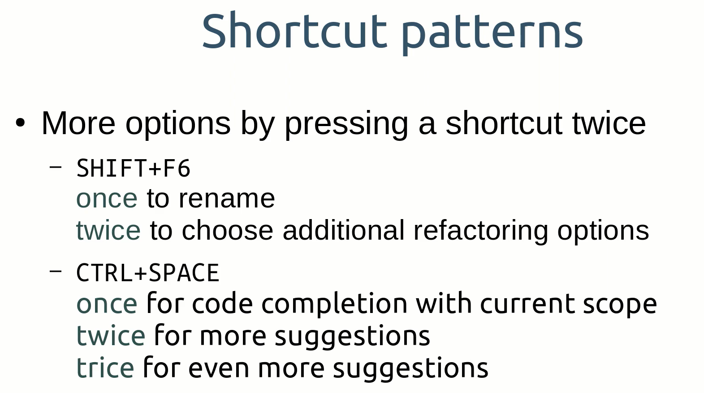
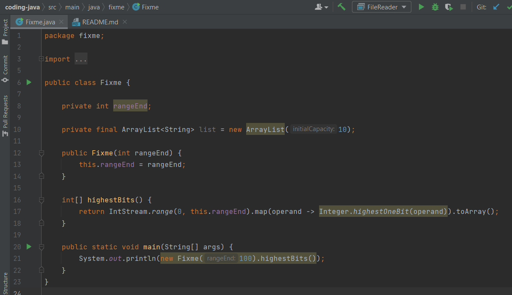
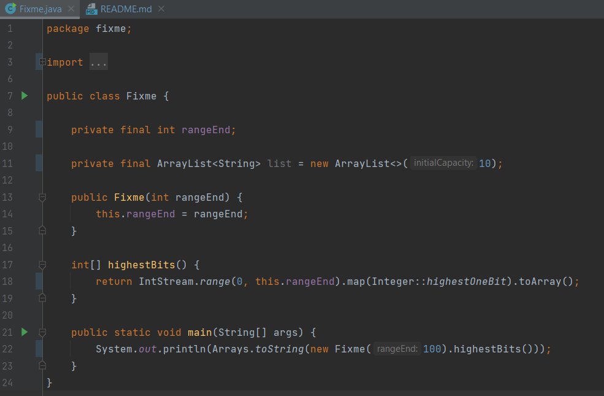

# INDEX

[1. INICIO](#1-inicio) 
- [1.1 ALT + INSERT: Creating packages and classes, generating constructors and methods](#11-alt--insert-creating-packages-and-classes-generating-constructors-and-methods) // [1.2 ALT + ENTER: Fixing various types of problems](#12-alt--enter-fixing-various-types-of-problems) // 

## 1. INICIO
[* Index](#index)

Some images to start:

Learn how to use IntelliJ:
- Tab: Help -> Learn IDE Features

### 1.1 ALT + INSERT: Creating packages and classes, generating constructors and methods
[* Index](#index)

- E.g. in: src/main/java 
- `Alt + Insert` .. to insert: package, class, constructor, getter&setter, toString, ...  

- In case a class has the 'home' attribute, in the Editor...
- ..for 'getter': write `gh` (it will display the `getHome` sintax).
- ..for 'setter': write `sh` (it will display the `setHome` sintax).

---

### 1.2 ALT + ENTER: Fixing various types of problems
[* Index](#index)

In the image, the highlighted code indicates that it can be refactored (or quick fix). 
Pressing `F2` we can jump from one to another.

To see the refactoring options:
- `F2` or place the cursor in the highlighted code -> `Alt + Enter`
- Not all fixes should be made, those are just recommendations.

**Before**

**After**

---
