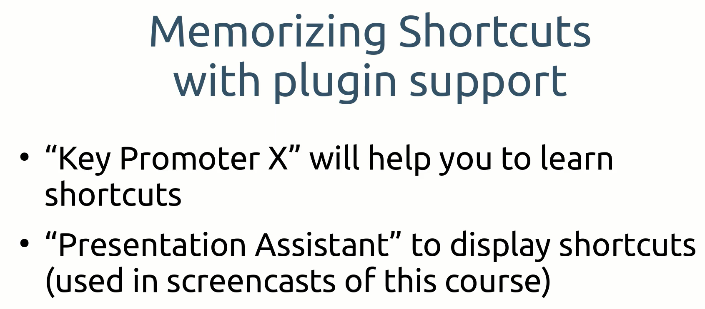

# INDEX

[1. INICIO](#1-inicio) 
- [1.1 ALT + INSERT: Creating packages and classes, generating constructors and methods](#11-alt--insert-creating-packages-and-classes-generating-constructors-and-methods) // 
[1.2 ALT + ENTER: Fixing various types of problems](#12-alt--enter-fixing-various-types-of-problems) // 
[1.3 Useful shortcuts for general editing](#13-useful-shortcuts-for-general-editing) //

## 1. INICIO
[* Index](#index)

Some images to start:

Learn how to use IntelliJ:
- Tab: Help -> Learn IDE Features

### 1.1 ALT + INSERT: Creating packages and classes, generating constructors and methods
[* Index](#index)

- E.g. in: src/main/java 
- `Alt + Insert` .. to insert: package, class, constructor, getter&setter, toString, ...  

- In case a class has the 'home' attribute, in the Editor...
- ..for 'getter': write `gh` (it will display the `getHome` sintax).
- ..for 'setter': write `sh` (it will display the `setHome` sintax).

---

### 1.2 ALT + ENTER: Fixing various types of problems
[* Index](#index)

In the image, the highlighted code indicates that it can be refactored (or quick fix). 
Pressing `F2` we can jump from one to another.

To see the refactoring options:
- `F2` or place the cursor in the highlighted code -> `Alt + Enter`
- Not all fixes should be made, those are just recommendations.

**Before**

**After**

---

### 1.3 Useful shortcuts for general editing
[* Index](#index)

- `Ctrl + X` .. to cut.
- `Ctrl + W` .. to select a word, line, block (if pressed many times).
- `Ctrl + D` .. to duplicate.
 
 
- To delete part of a word, locate in the middle of it:
  - `Ctrl + Backspace` .. to delete the left part.
  - `Ctrl + Supr` .. to delete the right part.
 
 
- `Ctrl + Shift + U` .. to upper-case and lower-case.
- `Ctrl + Shift + J` .. to join a String that is split in many lines.
 
 
- Multicursor: To edit many words in adjacent lines:
  - `Alt + drag-click` (drag the mouse to other lines).
- Multicursor in specific positions:
  - `Alt + Shift + Click`.
 
 
- `Alt + J` .. to select multiple occurrences of a selection, **one by one**.
- `Ctrl + Shift + Alt + J` .. to select multiple occurrences of a selection, **all at once**.
 
 
- `Ctrl + V` .. to paste.
- `Ctrl + Shift + V` .. to see the copy-history, select, and paste.
